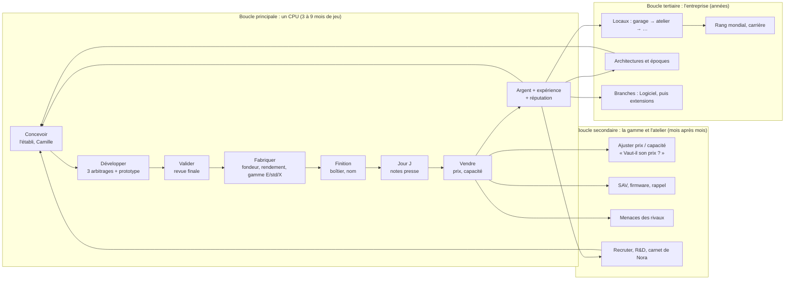

# Audit de game design : boucles, économie et sensations — 08/10/2026

Base : `v013/demo-octobre` (`18b1511`).

Sources :
- la sonde de carrière `tests/tools/career_probe.tscn`, lancée dans le cloud sur 4 graines, en Standard et en Accessible, de 1971 à 2030 ;
- le test `balance_ceiling_test` ;
- les audits d'événements et de logiciel du 08/10.

Les stratégies de la sonde sont des automates, pas des joueurs. Elles révèlent des tendances, pas un ressenti.

Le jeu n'a ni ennemis ni niveaux. Les notions du cadre d'audit sont donc adaptées :
- « ennemis » = les **concurrents** ;
- « niveaux » = les **générations, architectures et locaux** ;
- « puits de ressources » = les **dépenses qui retirent de l'argent du jeu**.

## 1. Les boucles

### Points de friction

| # | Où | Friction | Gravité |
|---|---|---|---|
| F1 | Début de partie, Standard | **Une falaise de trésorerie en 1972–1973.** La stratégie « adaptée » (elle recrute et finance la R&D tôt) fait faillite en **février 1973 sur 3 graines sur 4**. Le jeu ne prévient pas assez tôt que l'effectif dépasse ce que l'argent permet. | Élevée |
| F2 | Long terme, Accessible | **L'argent s'emballe : 190 à 214 M€ en 2030** avec la stratégie adaptée, contre 0,8 à 1 M€ pour la stratégie figée. Rien ne retire d'argent en proportion des gains : le jeu devient « trop facile », ce qu'Alexandre a constaté. | Élevée |
| F3 | Toutes difficultés | **La première place n'est jamais atteinte** (rang 4 à 7 sur toutes les parties). Il manque un objectif visible et atteignable au milieu de partie. | Élevée |
| F4 | Long terme, Standard | **Déclin après 2000** : la stratégie figée fait faillite entre 2011 et 2014, ce qui est voulu. Mais la stratégie adaptée fait aussi faillite en 1997 sur une graine. Le jeu ne dit pas assez *pourquoi* on décline (gamme vieillie, architecture dépassée). | Moyenne |
| F5 | Écart entre difficultés | De ×1 en 24 mois (le test vérifie au moins 15 % d'écart) à **×200 en 60 ans**. Les difficultés ne sont pas calibrées sur une carrière entière : `balance_ceiling_test` ne couvre que les 24 premiers mois. | Moyenne |
| F6 | Boucle principale | Pendant le développement, le joueur attend. Il y a 0 à 10 décisions par an selon les années (colonne `decisions` de la sonde), avec des années sans aucune décision. | Moyenne |
| F7 | Boucle secondaire | Des effets sont mal annoncés. Ceux du 08/10 sont corrigés (événements, prix, firmware) ; il faut garder cette règle pour tout nouveau choix. | Faible |

## 2. Modèle de progression et d'économie

### Ce qu'on mesure : quatre grandeurs suffisent

- **Autonomie** `A = trésorerie / dépenses mensuelles` : le nombre de mois que l'on tient sans ventes.
- **Retour d'une génération** `Rg = (marge cumulée de la gamme sur 24 mois) / (coût de développement + industrialisation)`.
- **Part des puits** `Π = dépenses hors fabrication / chiffre d'affaires` : salaires, R&D, locaux, marketing, SAV, impôt.
- **Écart au leader** `E = performance de notre meilleur CPU / performance du meilleur rival` sur le segment visé.

### Cibles, par phase de partie

| Phase | Années (indicatives) | Autonomie A | Retour Rg | Puits Π | Écart E du joueur « adapté » | Trésorerie (Standard) |
|---|---|---|---|---|---|---|
| Garage | 1971–1976 | 3 à 9 mois | 1,3 à 2,0 | 60 à 80 % | 0,85 à 1,0 | 0,1 à 0,6 M€ |
| Atelier, PME | 1977–1990 | 6 à 12 mois | 1,5 à 2,5 | 55 à 75 % | 0,95 à 1,10 (1re place possible) | 0,5 à 10 M€ |
| Siège, groupe | 1990–2010 | 6 à 18 mois | 1,3 à 2,0 | 60 à 80 % | 0,9 à 1,15 | 5 à 80 M€ |
| Empire | 2010+ | 9 à 24 mois | 1,2 à 1,8 | 65 à 85 % | 0,9 à 1,2 | 30 à 300 M€ |

Règles qui en découlent :
- **Difficultés** : à stratégie égale, la trésorerie Accessible doit rester entre **1,3 et 3 fois** celle du Standard, *sur toute la carrière*, et non 200 fois.
- **Ennemis = concurrents** : la performance des rivaux suit `P_rival(t) = P_0 · (1 + g_ère)^(t − t_0)`, avec `g_ère` repris du rythme technologique de l'époque (déjà donné par les architectures). Leur **réaction** croît avec notre part de marché `s` : baisse de prix `Δp = −k · max(0, s − 0,25)`, avec `k` environ 0,4 par point au-dessus de 25 %. On peut prendre la tête, mais la garder coûte.
- **Coût d'une génération** : `Coût_dev(n) = C_0 · 1,25^n · facteur_nœud`. Chaque génération coûte environ 25 % de plus que la précédente, ce qui suit le coût réel des nœuds de gravure.

### Puits de ressources à ajouter ou renforcer

Ils doivent être proportionnels, pour freiner l'emballement sans punir le début de partie.

| Puits | Formule proposée | Effet recherché |
|---|---|---|
| **Impôt sur les bénéfices** (annuel) | 0 % sous 200 k€ de bénéfice annuel, puis **25 %** au-delà, versé en janvier et annoncé par Nora en décembre | Freine l'emballement (F2) sans toucher le garage |
| **Coût croissant de la R&D** | `Coût_dev(n)` ci-dessus, avec un plafond par époque | Chaque génération reste un vrai pari |
| **Entretien des gammes anciennes** | `0,5 %` du chiffre d'affaires de la gamme par mois après 36 mois sur le marché (stocks, support, pièces) | Pousse à renouveler ou retirer, et rend le refresh utile |
| **Locaux et effectif** | Loyer par palier de locaux ; salaires indexés sur l'époque | Ils existent déjà ; à vérifier sur la carrière entière |
| **Investissements de prestige** (facultatifs) | Salons, campagnes, mécénat, déjà en partie présents | Transformer l'argent en réputation et en rang, pour donner un usage aux millions |

**Alerte d'autonomie (contre F1)** : avant chaque embauche ou budget de R&D, l'aperçu montre l'autonomie *après* la décision. Sous 3 mois, Nora prévient en orange ; sous 1 mois, en rouge, et il faut confirmer.

## 3. Sensations de jeu : la liste de contrôle

Ce qui existe déjà :
- `Juice.gd` : `pop_in`, `fade_in`, `slide_in`, `pulse_forever` et `count_label`, utilisés 13 fois ;
- 12 sons d'interface (le clic revient 11 fois, puis ouverture, erreur, déblocage, notification, succès, lancement, fermeture, décision, caisse et presse) ;
- la révélation du jour J, l'équipe animée au garage et quelques particules dans l'établi.

Le réglage « animations réduites » (`Juice.reduced_motion`) est respecté et doit le rester pour tout ce qui suit.

Les tremblements d'écran et les arrêts d'image de combat n'ont pas de sens ici ; on les remplace par des **temps de suspense** et des **tremblements discrets d'un seul élément**.

| Moment | Visuel | Son | Haptique (étape T6) | Durées |
|---|---|---|---|---|
| Appui sur un bouton | Échelle 0,96 au toucher, retour à 1 | `click` (déjà présent) | — | 60 ms à l'appui, 90 ms au retour |
| Confirmation d'une dépense | Le montant décompte dans le bouton, puis la trésorerie décompte dans l'en-tête | `cash` | 15 ms | 400 ms |
| Arbitrage de projet choisi | La carte choisie grossit à 1,05, les autres s'effacent | `decision` | 15 ms | 250 ms |
| **Jour J, révélation des notes** | **Pause de suspense de 600 ms** (écran figé, musique baissée), puis les notes tombent une à une, puis la moyenne apparaît avec un léger tremblement de la carte (±3 px) | `review`, puis `review_good` ou un son déçu | 30 ms, ou deux impulsions courtes si la note est mauvaise | 600 ms, puis 250 ms par note |
| Premier CPU, record de ventes, 1re place mondiale | **Confettis** (`CPUParticles2D`, 60 à 120 particules, 1,2 s, couleurs de la marque), le compteur monte jusqu'au record, bandeau doré | `success` ou `unlock` | 40 ms | 1,2 à 1,5 s |
| Clôture du mois | Le chiffre d'affaires et le résultat décomptent (`count_label`) ; vert ou rouge selon le signe | `cash` si positif | — | 600 ms |
| Alerte de trésorerie (autonomie < 3 mois) | L'en-tête de trésorerie pulse en orange, Nora apparaît | `notify` | 2 × 20 ms | Pulsation de 0,9 s |
| Erreur, action impossible | Tremblement horizontal du bouton (±6 px, 3 allers-retours) et raison affichée | `error` | 2 × 20 ms | 240 ms |
| Déménagement, nouvelle époque | Transition en fondu du décor, nouvelle musique d'époque | `unlock` | 40 ms | 1 s |

Budget : **3 effets majeurs au plus par minute de jeu**, pour que les grands moments restent forts. Les particules sont limitées à 120 et désactivées en animations réduites.

## Ce qui reste à vérifier humainement

- Le ressenti du début de partie en Standard (F1) : est-ce que la faillite de 1973 arrive à un vrai joueur, ou seulement à l'automate qui recrute trop vite ?
- Le niveau de difficulté visé pour la démo : Standard ou Accessible par défaut.
- Le dosage des nouveaux effets : sonner juste sans en faire trop.
